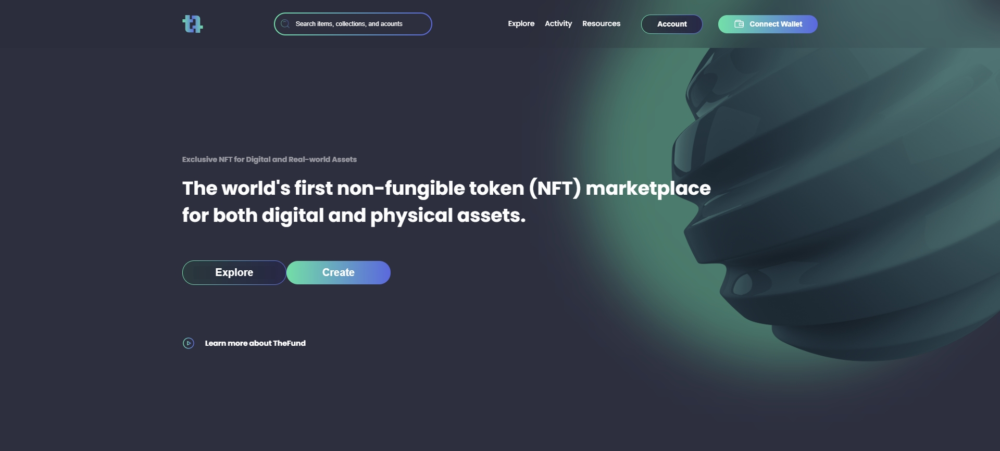

# Portfolio

  

## 💻 Sobre o projeto

---

<a href="https://nft-marketplace-emarra.vercel.app/" target="_blank">Versão online</a>

Layout retirado da Cominidade do [Figma](https://www.figma.com/file/72UK6TyIJZwzrFnIdR6mEU/NFT-Marketplace---Free-UI-Kit-Landing-Page-(Community)?node-id=0%3A1).

## 🚀 Tecnologias

---

Esse projeto foi desenvolvido com as seguintes tecnologias:

- HTML
- CSS
- Javascript
- Deploy realizado na Vercel

### Rodando localmente

1. Abrir arquivo `Index.html`

---
<!-- 
1. Instalar todos os pacotes com `yarn install`
2. Executar o comando `yarn dev`
3. Em alguns seguntos a URL: `http://localhost:3000/` ficará disponível -->
